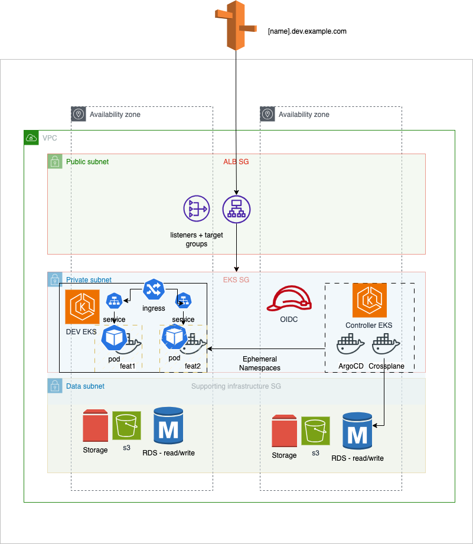
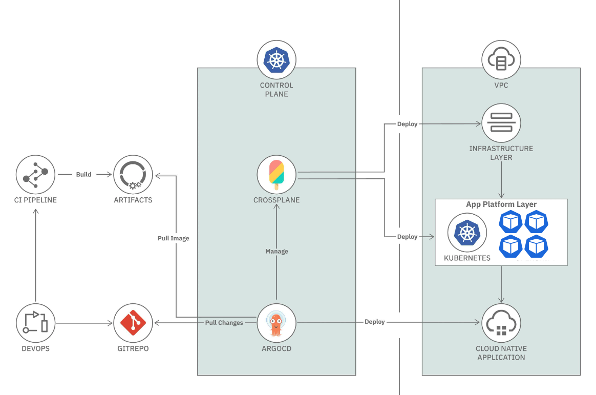
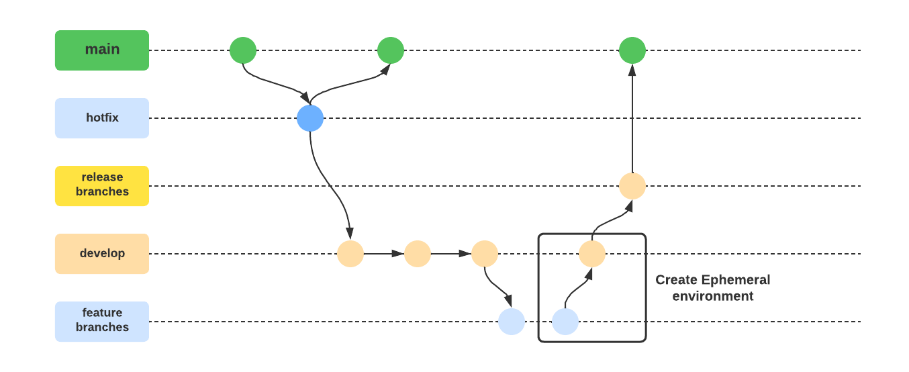

# test-luxpresence

# Architectural design test

<summary>Ephemeral Prompt:</summary>
<details>

Your team is responsible for delivering ephemeral environments to the other engineering teams. These environments should be created when a developer submits a pull request on GitHub. They should also mirror staging and production which runs microservices on Kubernetes and uses PostgreSQL as the primary database. You are free to pull in any other tool you see the need for — e.g., CI/CD, logging, and etc.
Whiteboard a system that addresses the following requirements:

Ephemeral environments should be spun up on-demand and torn down when no longer needed

Engineers should be able to access their environments via a URL

Environments should be able to be customized with different versions of dependencies (e.g., Service_A should be the feature branch a developer is working on and all other services represent the current version on staging/production)

Please walk us through your solution, including any relevant Kubernetes resources/components, and how you would ensure scalability, availability, and reliability.

Feel free to use any whiteboard tool to save your work for the interview. Here is one we recommend: https://excalidraw.com/
 
Please let me know if you have any questions!

</details>


# What are ad hoc environments?
Ad hoc environments are short-lived environments that are designed to be used for testing a specific set of features or for demoing a specific application configuration in an isolated environment. It is intended to be a functional duplicate of the main production environment. An ad hoc environment is the first cloud environment that the application code will be deployed to after a developer has been working on it in a local development environment.

## Key characteristics

* They are Automated and On Demand
* They are the Clone of The Production Environment 
* They are Shareable

# Infrastructure

[]()

[]()

## Requirements

* Terraform
* Github Actions
* AWS Access / secret


# Explanation


Read values from our Environment custom resource to provision a Kubernetes cluster using Crossplane’s custom resources (this implies we need Crossplane installed in our cluster). This will be taken care of by our Environment Controller.

Add the provisioned cluster to ArgoCD. This is done by taking the cluster connection secret that Crossplane creates for talking to the provisioned cluster and using the information in the secret to add the cluster to ArgoCD. Adding a cluster to ArgoCD is just creating a secret in ArgoCD’s namespace with specific annotations so that ArgoCD can recognize it as an added cluster (This is the TargetCluster in our image). This will be taken care of by our ArgoCD Connector controller which watches any newly created connection secrets in Crossplane’s namespace and uses it to create cluster connection in ArgoCD’s namespace for adding a cluster.

Read values from our Environment custom resource and install the applications in our provisioned cluster. This will be taken care of by our Environment Controller.

(optional, not shown in the image) If any TTL aka time to live is specified in the Environment custom resource, honor it and delete the cluster after the specified time. E.g., if TTL is specified as say 2h, delete the cluster after two hours. This will be taken care of by our Environment Controller

# Gitflow

[]()

* When PR gets created, ephemeral environment is started with a ArgoCD Webhook
name: Deploy PR Environment
```on:
  pull_request:
    types: [opened, reopened, synchronize]
```
* Using Kustomize to create the namespace dynamically according to short feature name (Ref https://docs.github.com/en/get-started/using-git/dealing-with-special-characters-in-branch-and-tag-names)

* On PR approve/merge the ephemeral environment gets deleted
```
      if: github.event.pull_request.merged == 'true'
```
    
