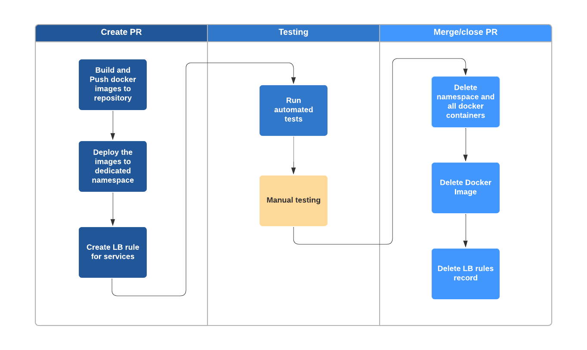
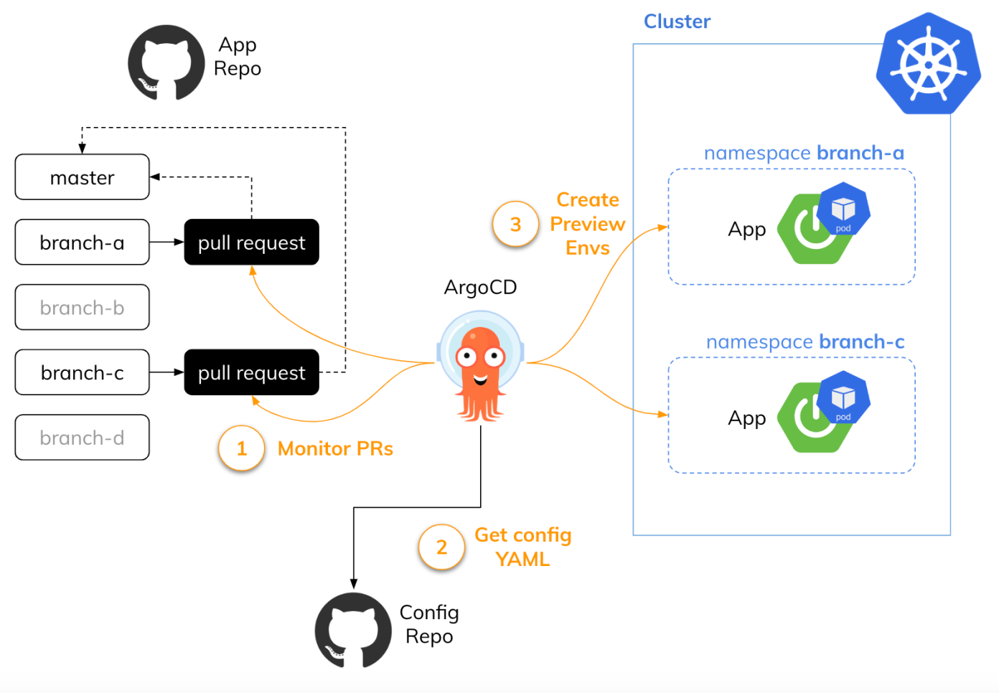

# test-luxpresence

# Architectural design test

<summary>Ephemeral Prompt:</summary>
<details>

```
Your team is responsible for delivering ephemeral environments to the other engineering teams. These environments should be created when a developer submits a pull request on GitHub. They should also mirror staging and production which runs microservices on Kubernetes and uses PostgreSQL as the primary database. You are free to pull in any other tool you see the need for — e.g., CI/CD, logging, and etc.
Whiteboard a system that addresses the following requirements:

Ephemeral environments should be spun up on-demand and torn down when no longer needed

Engineers should be able to access their environments via a URL

Environments should be able to be customized with different versions of dependencies (e.g., Service_A should be the feature branch a developer is working on and all other services represent the current version on staging/production)

Please walk us through your solution, including any relevant Kubernetes resources/components, and how you would ensure scalability, availability, and reliability.

Feel free to use any whiteboard tool to save your work for the interview. Here is one we recommend: https://excalidraw.com/
 
Please let me know if you have any questions!
```

</details>


# What are ad hoc environments?
Ad hoc environments are short-lived environments that are designed to be used for testing a specific set of features or for demoing a specific application configuration in an isolated environment. It is intended to be a functional duplicate of the main production environment. An ad hoc environment is the first cloud environment that the application code will be deployed to after a developer has been working on it in a local development environment.

## Key characteristics

* They are Automated and On Demand
* They are the Clone of The Production Environment 
* They are Shareable

# Infrastructure

[]()

[]()

## Requirements

* Terraform
* Github Actions
* AWS Access / secret


# Explanation

Terraform code is used to create

* Controller EKS --> where ArgoCd and Crossplane will live
* {name}_EKS Cluster --> example dev cluester

We will use Argo CD and / Crossplane’s custom resources  to create any supporting infrastrcture

We will use ArgoCD and the cluster connection secret that Crossplane creates for talking to the provisioned cluster and using the information in the secret to add the cluster to ArgoCD. 
Adding a cluster to ArgoCD is just creating a secret in ArgoCD’s namespace with specific annotations so that ArgoCD can recognize it as an added cluster (This is the TargetCluster in our image). 

Usually a ArgoCD Connector controller  watches any newly created connection secrets in Crossplane’s namespace and uses it to create cluster connection in ArgoCD’s namespace for adding a cluster/namespace.

(optional) If any TTL aka time to live is specified in the Environment custom resource, honor it and delete the cluster after the specified time. E.g., if TTL is specified as say 2h, delete the cluster after two hours. This will be taken care of by our Environment Controller


# CICD / Gitflow

Automated process:

* Build and push docker image to docker registry
* Deploy the app to dedicated namespace on Kubernetes Cluster
* Create Load Balancer listener rules
* Run automated tests
* Delete namespace and all services
* Delete docker image
* Delete Load Balancer rules

[]()

[]()

## ArgoCD Details

1. We will create the ArgoCD ApplicationSet with the Pull Request Generator. We are monitoring the app source code repository (1). 
2. We need Secret containing access token (2).
3. While the ApplicationSet targets the source code repository, the generated ArgoCD Application refers to the config repository (3).
4. It also sets several Helm parameters. The name of the preview namespace is the same as the name of the branch with the preview prefix (4). 
5. The app image is tagged with the commit hash and PR (5). We are also setting the name of the app image (6). All the configuration settings are applied automatically by ArgoCD (7).

```
apiVersion: argoproj.io/v1alpha1
kind: ApplicationSet
metadata:
  name: sample
spec:
  generators:
    - pullRequest:
        github:
          owner: xxx
          repo: sample # (1)
          tokenRef:
            key: token
            secretName: github-token # (2)
        requeueAfterSeconds: 60
  template:
    metadata:
      name: 'sample-spring-{{branch}}-{{number}}'
    spec:
      destination:
        namespace: 'preview-{{branch}}'
        server: 'https://kubernetes.default.svc'
      project: default
      source:
        # (3)
        path: preview/
        repoURL: 'xxxx'
        targetRevision: HEAD
        helm:
          parameters:
            # (4)
            - name: namespace
              value: 'preview-{{branch}}'
            # (5)
            - name: version
              value: '{{head_sha}}' + {{PR}}
            # (6)
            - name: image
              value: xxx
            - name: name
              value: xxx
      # (7)
      syncPolicy:
        automated:
          selfHeal: true
```
[]()


* When feat branch gets created it will push images to ECR + CICD with Snyk scans, Sonarqube, etc
```
jobs:
  docker:
    name: Docker Image
    runs-on: ubuntu-latest
    steps:
      - name: Checkout
        uses: actions/checkout@v2
      - name: Registry Login
        uses: docker/login-action@v1
        with:
          registry: ${{ secrets.ENDPOINT }}
          username: ${{ secrets.USERNAME }}
          password: ${{ secrets.PASSWORD }}
      - name: Build & Push
        uses: docker/build-push-action@v2
        with:
          push: true
          no-cache: true
          tags: ${{ secrets.ENDPOINT }}/${{ env.IMAGE_NAME }}:${{ env.PR_NUMBER }}
```
* When PR gets created, ephemeral environment is started with a ArgoCD Workflows / Triggers
name: Deploy PR Environment
```
on:
  pull_request:
    types: [opened, reopened, synchronize]
```
* Using Kustomize to create the namespace dynamically according to short feature name (Ref https://docs.github.com/en/get-started/using-git/dealing-with-special-characters-in-branch-and-tag-names)

* On PR approve/merge the ephemeral environment gets deleted
```
      if: github.event.pull_request.merged == 'true'
```

or
```
name: Destroy PR Environment
on:
  pull_request:
    types: [closed]
```
